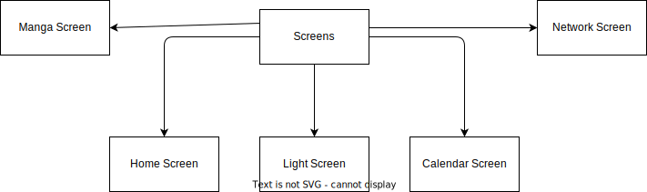

# Frontend Documentation

## Overview

Created a basic front end electron app that uses [React](https://react.dev) to create modern UI/UX for the application and fetches information from the backend.

## Technologies Used

<ol>
    <li>React Framework</li>
    <li> Electron Framework</li>
    <li>Node Package Manager (NPM)</li>
</ol>

## Screens
The application is divided into screens which have their respective layouts as well as the functions.

    

<figcaption align="center"><b><i>Figure 1: Application Screens</i></b></figcaption>
<ul>
    <li>Home Screen</li>
    <li>Light Screen</li>
    <li>Calendar Screen</li>
    <li>Network Screen</li>
    <li>Manga Screen</li>
</ul>

### Screen Functions

The Home Screen serves as the central hub and entry point for users, providing a unified interface to access and interact with various features and functionalities of the application.

The Light Screen serves as a specialized interface enabling users to control smart lights, manage connections, perform device scanning, and communicate with the server for data retrieval related to the smart light functionalities.

The Calendar Screen serves as an interface providing users with the ability to manage, edit, create, and display events in a minimalistic style on a calendar view. It interacts with the server to fetch existing events and send updated or new event data.

Manga Screen is able to search the manga by name and displays the search results. Manga can be viewed in a popup reader as per the standard with mangas.

The Network screen is only used to see how many of my devices are active. I want to connect my computer to the smart remote so I can put it to sleep or shut it down or use Wake On Lan protocol to wake it up without touching it.

## Styling

<b>Inspired by really elegant design from Dribbble: [Smart Home App Concept](https://dribbble.com/shots/5482985-Smart-Home-App-Concept)</b>

### API's Used
<ol>
    <li><a href="https://tailwindcss.com">Tailwind CSS</a></li>
    <li><a href="https://mui.com/material-ui/">Material UI</a></li>
    <li><a href="https://ui.shadcn.com">ShadCN</a></li>
    <li>Axios</li>
</ol>

## Future Improvements

<ul>
    <li> Implement Wake On Lan Protocol</li>
    <li> Add client to PC to listen for custom commands such as sleep</li>
    <li>Try New Style & Themes</li>
    <li>Screen Transitions</li>
    <li>MBTA Public Transport Schedule</li>
</ul>